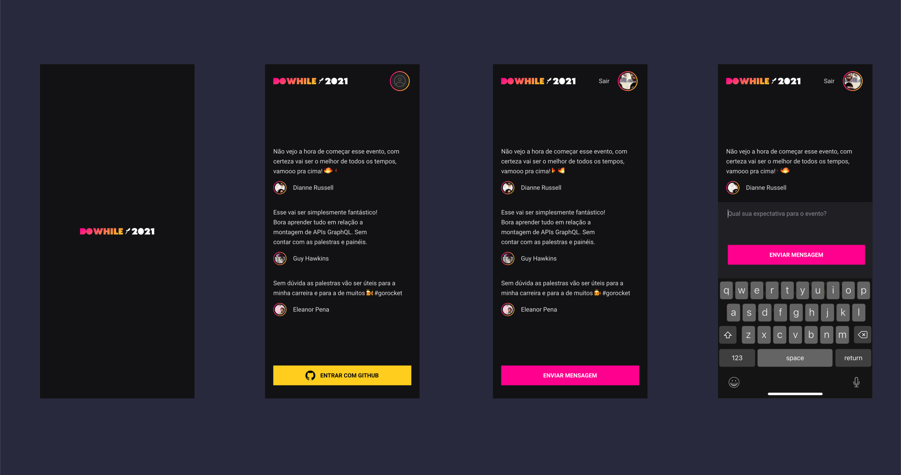

<h1 align="center">
  
</h1>

  <a href="#-tecnologias">Technologies</a>&nbsp;&nbsp;&nbsp;|&nbsp;&nbsp;&nbsp;
  <a href="#-projeto">Project</a>&nbsp;&nbsp;&nbsp;|&nbsp;&nbsp;&nbsp;
  <a href="#-layout">Layout</a>&nbsp;&nbsp;&nbsp;|&nbsp;&nbsp;&nbsp;
  <a href="#-como-executar">How to execute</a>

 

<h2>📱 Screens: </h2>

  

## ✨ Technologies

This project was developed with the following technologies:

- [React Native](https://reactnative.dev/)
- [TypeScript](https://www.typescriptlang.org/)
- [NodeJS](https://nodejs.org/en/)

## 💻 Project

DoWhile is a web application for questions and clarifications about the event that took place in December 2021, you can ask questions, answer questions and interact with people on the platform!

## 🔖 Layout

You can view the layout of the project through [this link](https://www.figma.com/community/file/1031699316177416916).

## 🚀 How to run

- clone the repository with `git clone https://github.com/Mateus-Kent/NLW-Heat-ReactNative.git`
- Install the [Node.js](https://nodejs.org/en/download/)
- Install the dependencies with [Yarn](https://classic.yarnpkg.com/en/docs/install/#windows-stable)
- Start with the command `expo start`